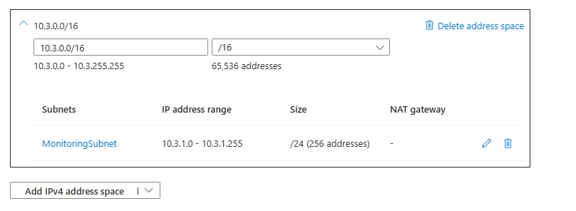
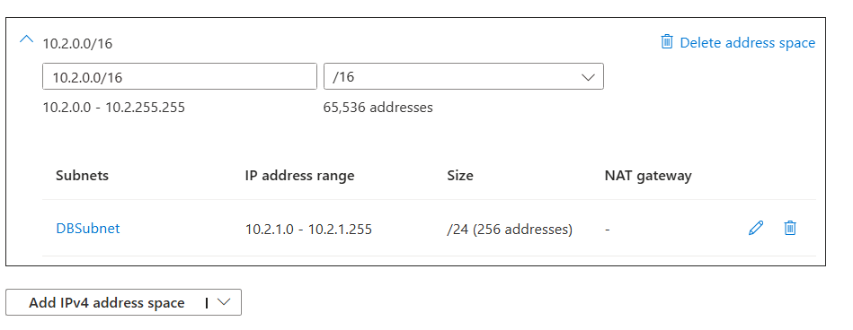
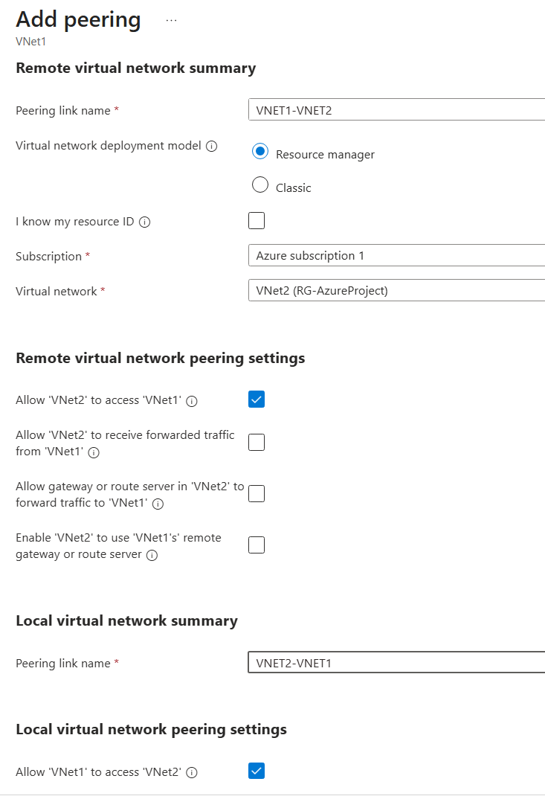
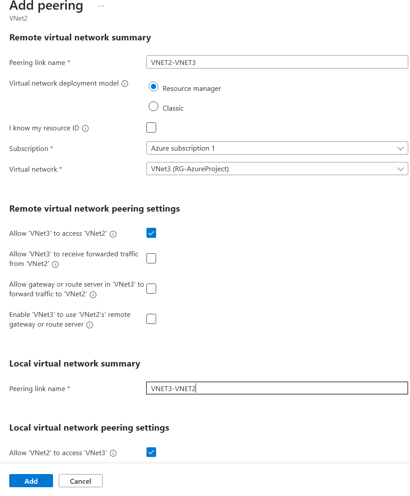
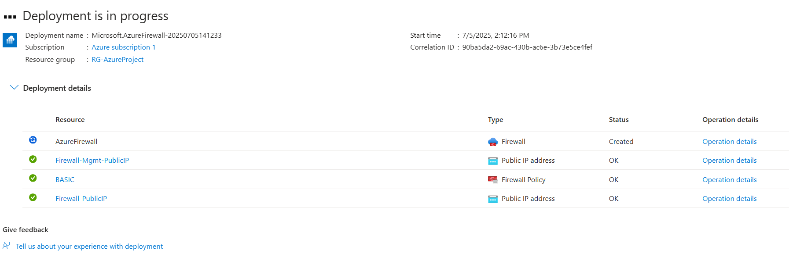
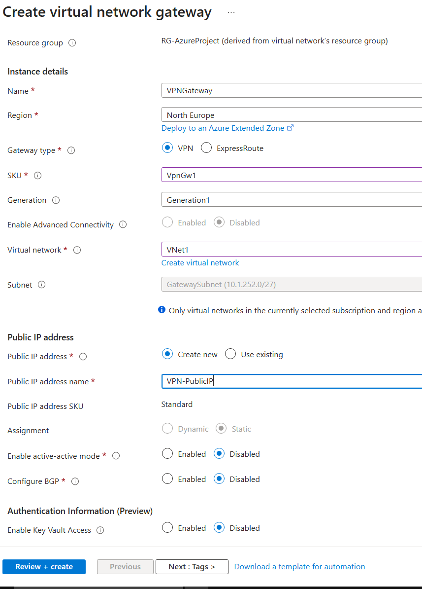
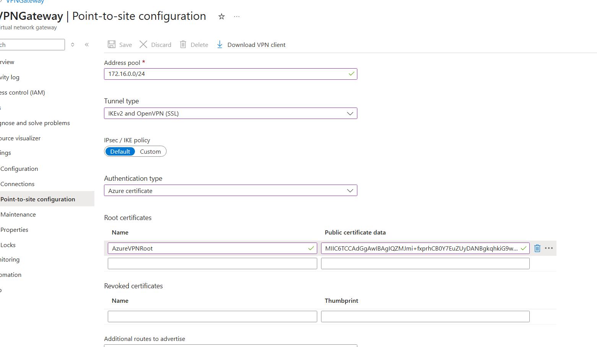
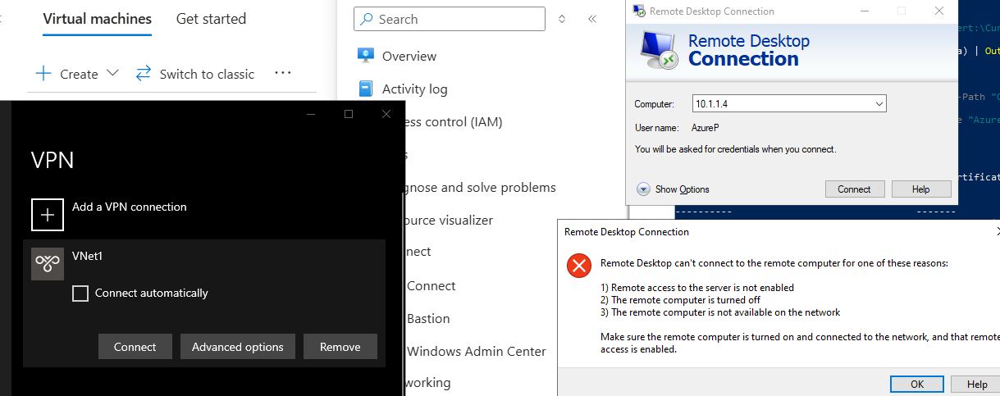
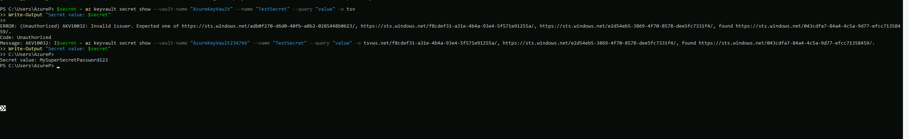

# Azure Secure Infrastructure Deployment - Full Documentation

This document provides detailed documentation of a complete Azure infrastructure project, designed to simulate a secure enterprise-grade environment for learning, testing, and portfolio purposes.

---

## 🔢 Project Overview

This project demonstrates the deployment of a multi-tier Azure environment with secure networking, firewalling, VPN connectivity, monitoring, and secret management.

### Key Components:

- Azure Virtual Networks (VNets)
- Subnets and Network Segmentation
- Azure Bastion for secure remote access
- Azure Firewall (Basic SKU) with forced tunneling
- Point-to-Site (P2S) VPN using Azure Certificate Authentication
- Azure Monitor and Log Analytics Workspace
- Azure Key Vault with Managed Identity-based access

---

## 🌐 Network Infrastructure

### Virtual Network: `VNet1`

- Address Space: `10.1.0.0/16`

### Subnets:

| Subnet Name                   | Address Prefix | Purpose                     |
| ----------------------------- | -------------- | --------------------------- |
| WebSubnet                     | 10.1.1.0/24    | Application Tier (VMs)      |
| AzureBastionSubnet            | 10.1.255.0/26  | Required for Azure Bastion  |
| AzureFirewallSubnet           | 10.1.254.0/24  | Required for Azure Firewall |
| AzureFirewallManagementSubnet | 10.1.253.0/26  | Firewall management traffic |
| GatewaySubnet                 | 10.1.252.0/27  | Required for VPN Gateway    |

### Key Services Deployed:

- Azure Bastion (for secure RDP/SSH without Public IP)
- Azure Firewall (Basic SKU) for centralized network security
- VPN Gateway (VpnGw1 SKU, active-active disabled) for Point-to-Site VPN

#### Network VNet3 Screenshot:



#### Network Topology Screenshot:



---
---

## 🔗 Virtual Network Peering Configuration

This project includes **VNet Peering** between multiple virtual networks to enable seamless, private communication across different VNets.

### Peering Connections:
| Peering | Source VNet | Destination VNet | Status   |
|---------|-------------|------------------|----------|
| VNet1-VNet2 Peering | VNet1 | VNet2 | Connected |
| VNet1-VNet3 Peering | VNet1 | VNet3 | Connected |
| VNet2-VNet3 Peering | VNet2 | VNet3 | Connected |

#### Peering Screenshots:
## VNet1 to VNet2:


## VNet1 to VNet3:


## VNet2 to VNet3:


---

### Key Peering Features:
- Enables full private connectivity between VNets.
- Uses Microsoft backbone network — secure & high-speed.
- No need for public IPs or VPNs for cross-VNet traffic.

---

## 🏠 Azure Firewall Configuration

- SKU: Basic
- Firewall Management NIC enabled
- Forced Tunneling Supported
- Route Table ready for further Forced Tunneling configuration

#### Azure Firewall Creation Screenshot:



---

## 🏡 VPN Gateway Configuration

- VPN Type: Route-based
- SKU: VpnGw1 (cost-effective)
- Tunnel Type: IKEv2 and OpenVPN (SSL)
- Authentication Type: Azure Certificate

### Point-to-Site VPN Address Pool:

- `172.16.0.0/24`

### Certificate Authentication:

- Self-signed root and client certificates generated using PowerShell
- VPN client profiles successfully downloaded and tested

#### VPN Gateway Creation Screenshot:



#### VPN Gateway Configuration Screenshot:



#### VPN Gateway (if not connected to vpn gateway its not working) Screenshot:




---

## 🔹 Monitoring & Log Analytics

### Log Analytics Workspace:

- Workspace Name: `LogAnalyticsWorkspace`
- Linked to VM1 for performance and log monitoring

### Azure Monitor:

- Enabled for VM1 (Azure Insights)
- Ready for custom alerts and diagnostics

---

## 🔐 Azure Key Vault Integration

### Key Vault Name: `AzureKeyVault234746`

- Secrets stored: `TestSecret` ➔ `MySuperSecretPassword123`

### VM Identity Configuration:

- System-assigned Managed Identity enabled on VM1
- Role Assignment: `Key Vault Secrets User` via Azure RBAC (IAM)

### Secret Access Command (from VM):

```powershell
az login --identity
$secret = az keyvault secret show --vault-name "AzureKeyVault234746" --name "TestSecret" --query "value" -o tsv
Write-Output "Secret value: $secret"
```

### Secret Access screenshot (from VM):




